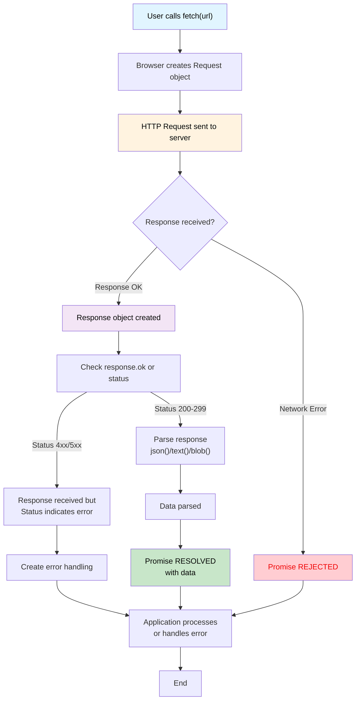

# What is *fetch( )* ?
fetch is  a api which start a process of fetching a resouce from network.
returning a `promise` which fulfillled once the response is avilable.

# How Fetch API Works

## Key Points:
- `fetch()` returns a Promise
- ***The promise resolves with a Response object (even if HTTP status is 404 or 500)***
- You must check `response.ok` or `response.status` to verify success
- Network errors or failed requests reject the promise
- Use `.json()`, `.text()`, or `.blob()` to parse the response body
- Always handle both success and error cases with `.then().catch()` or `async/await`
## Fetch API Flow Diagram

